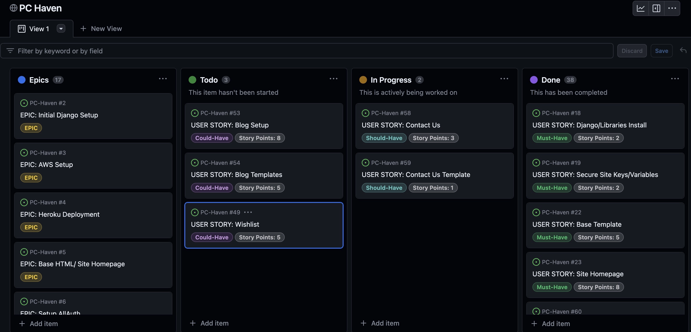
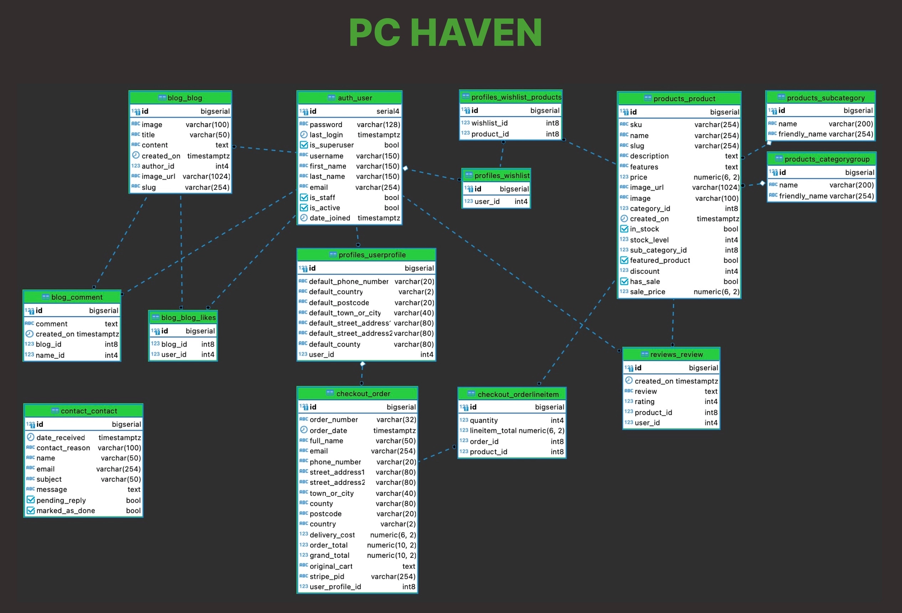

# **PC HAVEN**

## **Overview**

PC HAVEN is a B2C e-commerce site that sells Computer components. The site allows both registered and guest users to add Products to cart and checkout. Users of the site can search for products via search bar, filter Products or browse through all products available.

There are features available to Registered users including a personal Profile, Wishlist, the ability to review their Order history, add Product reviews and like Blog posts. The site also allows the user to subscribe to the PC HAVEN Newsletter and there is a Contact Us page in place if user needs to Contact the site owner to report issues.

Developed by Sean Finn.

[PC HAVEN - Live Webpage](https://pc-haven.herokuapp.com/) (Right-click to open in a new tab)

## **Project Goals**

This is my fifth portfolio project for [Code Institute](https://codeinstitute.net/) and my goal with this project is to display the skills I have learned throughout the course. I decided to build a Computer components e-commerce site as building PCs is something I am interested in.

## **Contents**

1. [Overview](#overview)
1. [Project Goals](#project-goals)
1. [UX](#ux)
   - [The Strategy Plane](#the-strategy-plane)
     - [The Ideal User](#the-ideal-user)
     - [Site Goals](#site-goals)
   - [Agile Planning](#agile-planning)
     - [Epics](#epics)
     - [User Stories](#user-stories)
   - [The Skeleton Plane](#the-skeleton-plane)
     - [Wireframes](#wireframes)
     - [Database Schema](#database-schema)
     - [Security](#security)
   - [The Scope Plane](#the-scope-plane)
   - [The Structure Plane](#the-structure-plane)
     - [Features](#features)
     - [Future Features](#future-features)
   - [The Surface Plane](#the-surface-plane)
     - [Design](#future-features)
       - [Colour Scheme](#colour-scheme)
       - [Typography](#typography)
       - [Imagery](#Imagery)
1. [Ecommerce Business Model](#ecommerce-business-model)
1. [Marketing Strategy](#marketing-strategy)
   - [Social Media Marketing](#social-media-marketing)
   - [Newsletter Marketing](#newsletter-marketing)
1. [Search Engine Optimization (SEO)](#search-engine-optimization-seo)
   - [Keywords](#keywords)
   - [Page Titles](#page-titles)
   - [Sitemap.xml](#sitemapxml)
   - [Robots.txt](#robotstxt)
1. [Technologies Used](#technologies-used)
   - [Languages Used](#languages-used)
   - [Frameworks and Tools Used](#frameworks-and-tools-used)
   - [Libraries Used](#libraries-used)
1. [Testing](#testing)
1. [Deployment](#deployment)
1. [Credits](#credits)
1. [Acknowledgements](#acknowledgements)

## **UX**

## **The Strategy Plane**

PC HAVEN is intended to be a one stop shop for users looking to purchase Computer components. It is a business to consumer e-commerce site supplying various Computer components. All users will be able to browse/sort Products, add to cart and checkout. Registered users will be able to add Products to their Wishlist, view their Order history and update/save their delivery information for quicker checkouts. Registered users will also be able to review Products and like/comment on Blog posts.

Staff will be able to add/edit/delete Products and add/edit/delete Blog Posts without entering admin. Any user reviews can be edited/deleted by Staff if required. When dealing with Products Staff will be able to make a Product a featured Product to be displayed on Homepage or put a Product on sale.

The graphical elements and overall design of the site provide the user with an enjoyable experience with an aesthetically pleasing display.

### **The Ideal User**

- Someone looking to purchase Computer components
- Someone who would like to review/rate Products
- Someone who would like to create a wishlist of Products
- Someone who would like to view a tech Blog

### **Site Goals**

- To provide users with a place to purchase Computer components
- To provide users with the ability to review/rate products
- To provide users with the ability to create their own Profile and add Products to a Wishlist
- To provide users with the ability to view Blog posts related to tech

[Back to top &uarr;](#contents)

## **Agile Planning**

This project was developed using agile methodologies by delivering small features across the duration of the project. All User Stories were assigned to Epics, prioritized under the labels, Must Have, Should Have and Could Have. They were assigned story points according to complexity. Fibonacci sequence is employed for the Story points. "Must Have" stories were completed first, "Should Have's" and then finally "Could Have's".

It was done this way to ensure that all core requirements were completed first to give the project a complete feel. In some scenarios, certain "Should Have's" were implemented before schedule due to the nature of the implementation i.e. some Product related "Should Have's" were done during Product development with some "Must Have's" - Error templates developed later on. The rest were applied based on capacity and timing.

The Kanban board was created using Github projects and can be located [here](https://github.com/users/seanf316/projects/8) and can be viewed to see more information on the project cards. All stories have a full set of acceptance criteria to define the functionality that marks that story as complete.

### **Epics**

18 Epics (milestones) were created which were then further developed into 45 User Stories. The details on each epic, along with the user stories linked to each one can be found in the project kanban board linked above. 2 Epics "Blog" & "Documentation" were missed when adding Epics at the start of the Project and were added at the time of implementation.

#### **EPIC: Initial Django Setup [#1](https://github.com/seanf316/PC-Haven/issues/2)**

`As a Developer, I can setup Django and start project, so that I can develop the site`

The Initial Django Setup epic was required to setup the project and confirm libraries, frameworks etc were installed correctly. Only then could further development progress.

#### **EPIC: AWS Setup [#2](https://github.com/seanf316/PC-Haven/issues/3)**

`As a Developer, I can setup AWS, so that I can store my static and media files for the site.`

AWS was setup to store all static and media files, this was done early in project development to help with early deployment.

#### **EPIC: Heroku Deployment [#3](https://github.com/seanf316/PC-Haven/issues/4)**

`As a Developer, I can deploy my site with Heroku, so that user's can view and interact with the site`

The Heroku Deployment epic was completed early on as we were advised during the course material that early deployment is critical to avoid any issues down the line with the production app. Heroku app was created and config vars were updated, app was linked to my projects Github repo for automatic deployments.

#### **EPIC: Base Html/Homepage [#4](https://github.com/seanf316/PC-Haven/issues/5)**

`As a Developer, I can design a nice aesthetically pleasing Homepage, so that the user has an enjoyable experience when entering the site`

The Base Html/Homepage epic was used to link various User Stories based around the design and responsiveness of the site. The Base template was created first so I could extend within further templates and then the homepage(index.html) was built using bootstrap and styled.

#### **EPIC: Setup AllAuth [#5](https://github.com/seanf316/PC-Haven/issues/6)**

`As a Developer, I can install AllAuth, so that it handles all the sites Authentication including Sign Up/Login/Logout/Email Verification and Password Reset`

AllAuth was installed to manage all of the sites authentication. Various User Stories were assigned to this Epic.

#### **EPIC: Products Setup (CRUD) [#6](https://github.com/seanf316/PC-Haven/issues/7)**

`As a Developer, I can setup Products to be displayed to the User, so that they can browse Products they may want to purchase`

The Products Setup Epic was used to link various User Stories based around the design and implementation of all the Product functionality.

#### **EPIC: Purchasing/Checkout [#7](https://github.com/seanf316/PC-Haven/issues/8)**

`As a Developer, I can create the Checkout functionality, so that customers can purchase Products on the site`

The Purchasing/Checkout was used to link various User Stories based around the design and implementation of all the Checkout functionality.

#### **EPIC: Stripe Setup [#8](https://github.com/seanf316/PC-Haven/issues/9)**

`As a Developer, I can setup Stripe, so that customers can successfully pay for their chosen Products`

The Stripe Epic covered any of the Stripe related User Stories. Stripe was installed to allow users to pay for their chosen Products.

#### **EPIC: User Profile (CRUD) [#9](https://github.com/seanf316/PC-Haven/issues/10)**

`As a Developer, I can add a Profile page for the user, so that they can store information about themselves i.e. Name, Shipping/Billing Address etc`

The User Profile epic is for all User Stories related to the setup of the profile, the CRUD functionality and templates design.

#### **EPIC: User Wishlist [#10](https://github.com/seanf316/PC-Haven/issues/11)**

`As a Developer, I can provide the User with a Wishlist function/page, so that they can add products to a Wishlist for future purchases`

The Wishlist epic was used to link any User Stories related to the setup of the Wishlist functionality and design.

#### **EPIC: Setup Email [#11](https://github.com/seanf316/PC-Haven/issues/12)**

`As a Developer, I can setup email functionality on the site, so that customers can receive emails containing such information like verification emails/password reset/order info etc`

The Setup Email epic was used to link any User Stories for the implementation of email functionality for the site. This was progressed early on in the development to be ready for early deployment.

#### **EPIC: Review Products (CRUD) [#12](https://github.com/seanf316/PC-Haven/issues/13)**

`As a Developer, I can add a Review option on the site Products, so that the user can provide their feedback on Products`

The Review Products epic is for all User Stories related to the Review Product functionality. Any templates created or styled were linked also.

#### **EPIC: Web Marketing [#13](https://github.com/seanf316/PC-Haven/issues/14)**

`As a Developer, I can create a Facebook page and Newsletter for the site, so that customers can follow the site via their Facebook account or subscribe to our sites Newsletter to keep up to date with new sales or products that may be launching`

The Web Marketing epic is for all User Stories related to Web Marketing like the setup of Newsletter and site Facebook page.

#### **EPIC: SEO [#14](https://github.com/seanf316/PC-Haven/issues/15)**

`As a Developer, I can research Google to find a list of short and long tail keyword, so that they can be applied to the sites code for SEO consideration`

The SEO epic is for all User Stories related to the site SEO implementation.

#### **EPIC: Contact Us [#15](https://github.com/seanf316/PC-Haven/issues/16)**

`As a Developer, I can provide functionality for users to Contact the site admin directly, so that they can provide feedback on the site or get in touch if they experience issues on the site`

The Contact Us epic is for all User Stories related to the Contact functionality. Any templates created or styled were linked also.

#### **EPIC: Status Error Templates [#16](https://github.com/seanf316/PC-Haven/issues/17)**

`As a Developer, I can create Status Error templates, so that I can secure my views and advise User when there is an issue`

The Status Error Templates epic is for all User Stories related to providing status error feedback to the User like 403, 404 and 500 status errors. Any templates created or styled were linked also.

#### **EPIC: Blog [#17](https://github.com/seanf316/PC-Haven/issues/52)**

`As a Developer, I can create functionality to add Blog Posts to the site, so that customers visiting the site can view posts related to the site and may spend more time on the site.`

The Blog epic is for all User Stories related to the Blog functionality. Any templates created or styled were linked also.

#### **EPIC: Documentation [#18](https://github.com/seanf316/PC-Haven/issues/63)**

`As a Developer, I can create documentation, so that fellow developers can understand what the site is and how it was built`

This epic is for all document related stories and tasks that are needed to document the software development lifecycle of the application. It aims to deliver quality documentation, explaining all stages of development and necessary information on running, deploying and using the application.

[Back to top &uarr;](#contents)

### **User Stories**

The following user stories (by epic) were completed throughout development.

#### **EPIC: Initial Django Setup [#1](https://github.com/seanf316/PC-Haven/issues/2)**

- As a Developer I can set up Django and install the supporting libraries predicted to be needed so that I am ready to start development [#19](https://github.com/seanf316/PC-Haven/issues/18)
- As a Developer I need to create the env.py and add to .gitignore so that I can securely deploy the site without exposing developer keys/information [#20](https://github.com/seanf316/PC-Haven/issues/19)

#### **EPIC: AWS Setup [#2](https://github.com/seanf316/PC-Haven/issues/3)**

- As a Developer I can setup the AWS Groups/Policies and Users so that so that the hosted static and media files are available to site when deployed. [#21](https://github.com/seanf316/PC-Haven/issues/20)

#### **EPIC: Heroku Deployment [#3](https://github.com/seanf316/PC-Haven/issues/4)**

- As a Developer I can deploy site to Heroku early so that I can confirm everything works before development of the site and to enable continuous testing within the production environment [#22](https://github.com/seanf316/PC-Haven/issues/21)

#### **EPIC: Base Html/Homepage [#4](https://github.com/seanf316/PC-Haven/issues/5)**

- As a Developer I can build a base template so that it can be extended to any templates that may require it [#23](https://github.com/seanf316/PC-Haven/issues/22)
- As a Developer I can design an aesthetically pleasing Homepage so that users have a positive experience when visiting the site [#24](https://github.com/seanf316/PC-Haven/issues/23)
- As a Developer I can implement message toasts so that the user/customer is alerted when they carry out and action or encounter and error. [#45](https://github.com/seanf316/PC-Haven/issues/45)

#### **EPIC: Setup AllAuth [#5](https://github.com/seanf316/PC-Haven/issues/6)**

- As a User I want to Sign Up/Login and Logout so that I can see what features are available to registered users [#25](https://github.com/seanf316/PC-Haven/issues/24)

#### **EPIC: Products Setup (CRUD) [#6](https://github.com/seanf316/PC-Haven/issues/7)**

- As a Developer I can create functional code to apply Products to my site so that the customer has Products to purchase [#27](https://github.com/seanf316/PC-Haven/issues/26)
- As a User I would like the ability to search for a product so that to see if the site sells it [#28](https://github.com/seanf316/PC-Haven/issues/27)
- As a User I would like to view a page containing the search results from my Product search so that so that I can find my prefered Product or see similar Products [#29](https://github.com/seanf316/PC-Haven/issues/28)
- As a User I would like a page that displays All Products the site offers so that I can browse and find products that I may want to purchase [#30](https://github.com/seanf316/PC-Haven/issues/29)
- As a User I would like the ability to sort products so that I can identity the best priced Products the site offers [#31](https://github.com/seanf316/PC-Haven/issues/30)
- As a Developer I can allow the functionality to edit Products by staff members so that they can reduce/increase prices, change product descriptions/images etc [#32](https://github.com/seanf316/PC-Haven/issues/31)
- As a Developer I can add functionality for staff members to delete Products so that if they do not sell or there is problems with the Product it can be removed from the storefront [#33](https://github.com/seanf316/PC-Haven/issues/32)
- As a User I would like to view the details of any Product so that I can see if the Product has the required specifications that I need/want [#34](https://github.com/seanf316/PC-Haven/issues/33)

#### **EPIC: Purchasing/Checkout [#7](https://github.com/seanf316/PC-Haven/issues/8)**

- As a Customer I would like to add items that to a cart so that I can view all items and purchase or remove items at will. [#35](https://github.com/seanf316/PC-Haven/issues/34)
- As a Customer I would like to view all items in my cart so that I can manage the items I want to buy. [#36](https://github.com/seanf316/PC-Haven/issues/36)
- As a Developer I can add in functionality to advise customer of free delivery at a certain threshold so that customer is aware of delivery costs and can add more items if price is suitable. [#37](https://github.com/seanf316/PC-Haven/issues/37)
- As a Customer I would like to adjust/remove the amount of a certain item so that I can manage my items for purchase. [#38](https://github.com/seanf316/PC-Haven/issues/38)
- As a Customer I would like to receive a confirmation of my order so that I know the purchase has went through and I can see what I ordered [#39](https://github.com/seanf316/PC-Haven/issues/39)
- As a Developer I can add the code to update the stock levels when a purchase has occurred so that shop owner can manage the stock levels and order where required [#40](https://github.com/seanf316/PC-Haven/issues/40)
- As a Customer, I would like to save my billing/shipping information, so that I don't need to enter these details on every purchase [#41](https://github.com/seanf316/PC-Haven/issues/41)
- As a Developer I can create a checkout page so that the customer can enter their billing/shipping/payment information to complete purchase. [#42](https://github.com/seanf316/PC-Haven/issues/42)
- As a Customer I would like the ability to edit the quantity of an item in my cart so that I can update the amount I want to buy of a specific item [#43](https://github.com/seanf316/PC-Haven/issues/43)
- As a Customer I would like to remove an item from my cart so that if i decide its not what I want i can easily remove that item and continue purchase with the rest of my cart items [#44](https://github.com/seanf316/PC-Haven/issues/44)

#### **EPIC: Stripe Setup [#8](https://github.com/seanf316/PC-Haven/issues/9)**

- As a Developer I can implement Stripe so that it can manage payments for the site products at checkout [#46](https://github.com/seanf316/PC-Haven/issues/46)

#### **EPIC: User Profile (CRUD) [#9](https://github.com/seanf316/PC-Haven/issues/10)**

- As a customer I would like the ability to create my own Profile page so that I can save my shipping address for future purchases and track my orders [#47](https://github.com/seanf316/PC-Haven/issues/47)
- As a Developer I can implement functionality to allow a customer to save information to a personal Profile so that they can save information i.e. shipping address/orders for future review [#48](https://github.com/seanf316/PC-Haven/issues/48)

#### **EPIC: User Wishlist [#10](https://github.com/seanf316/PC-Haven/issues/11)**

- As a Customer I would like the ability to add products to a Wishlist so that I can keep a list of my products to purchase in the future [#49](https://github.com/seanf316/PC-Haven/issues/49)

#### **EPIC: Setup Email [#11](https://github.com/seanf316/PC-Haven/issues/12)**

- As a Developer I can add functionality to verify email and reset password so that the user has better security over their email being used and can reset password if they forget it [#26](https://github.com/seanf316/PC-Haven/issues/25)

#### **EPIC: Review Products (CRUD) [#12](https://github.com/seanf316/PC-Haven/issues/13)**

- As a Customer I would like to leave a review on a Product so that my fellow shoppers can benefit from my feedback and make informed purchasing decisions. [#50](https://github.com/seanf316/PC-Haven/issues/50)
- As a Developer I can build a page to display the Review form so that customer has the ability to write their review and submit it. [#51](https://github.com/seanf316/PC-Haven/issues/51)

#### **EPIC: Web Marketing [#13](https://github.com/seanf316/PC-Haven/issues/14)**

- As a Developer I can create a Facebook business page for my site so that I can market my website on the social platform [#60](https://github.com/seanf316/PC-Haven/issues/61)
- As a Developer I can implement a newsletter on my site so that customers can subscribe for future updates and deals which should bring them back to the site for future purchases. [#61](https://github.com/seanf316/PC-Haven/issues/62)

#### **EPIC: SEO [#14](https://github.com/seanf316/PC-Haven/issues/15)**

- As a Developer I can add helpful description and keywords so that my site can reach a wider audience [#59](https://github.com/seanf316/PC-Haven/issues/60)

#### **EPIC: Contact Us [#15](https://github.com/seanf316/PC-Haven/issues/16)**

- As a Developer I can add functionality to allow the customer to contact the site owner so that any issue they encounter can be logged and resolved [#57](https://github.com/seanf316/PC-Haven/issues/58)
- As a Developer I can build a Contact template so that customer can submit their issues [#58](https://github.com/seanf316/PC-Haven/issues/59)

#### **EPIC: Status Error Templates [#16](https://github.com/seanf316/PC-Haven/issues/17)**

- As a Developer I can implement a 403 error page to redirect unauthorised users so that I can secure my views [#54](https://github.com/seanf316/PC-Haven/issues/55)
- As a Developer I can implement a 404 error page so that I can alert users when they have accessed a page that doesn't exist [#55](https://github.com/seanf316/PC-Haven/issues/56)
- As a Developer I can implement a 500 error page so that I can alert users when an internal server error occurs [#56](https://github.com/seanf316/PC-Haven/issues/57)

#### **EPIC: Blog [#17](https://github.com/seanf316/PC-Haven/issues/52)**

- As a Developer I can create the functionality for site admin to add Blog Posts so that customer may spend more time on the site which may lead to more purchases. [#52](https://github.com/seanf316/PC-Haven/issues/53)
- As a Developer I can build some Blog related templates so that the site admin can display blog posts on their site for a good customer experience [#53](https://github.com/seanf316/PC-Haven/issues/54)

#### **EPIC: Documentation [#18](https://github.com/seanf316/PC-Haven/issues/63)**

#### **EPIC: Complete Documentation [#10](https://github.com/seanf316/PC-Haven/issues/10)**

- Create/Write README.md [#62](https://github.com/seanf316/PC-Haven/issues/64)
- Create/Write TESTING.md [#63](https://github.com/seanf316/PC-Haven/issues/65)

[Back to top &uarr;](#contents)

## **The Skeleton Plane**

#### **Wireframes**

This is the prototype of the project that may change during its development. Further styling was applied to Allauth email and password templates but they were not in the original scope of the project.

Desktop

Tablet

Mobile

#### **Database Schema**

Entity relationship diagram was created using [DBeaver](https://dbeaver.io/) and shows the schemas for each of the models and how they are related.

#### **Security**

Views were secured where needed using the Django decorator @login_required. Access to the views using the @login_decorator can only be accessed by registered users. This means that if a user tries to access a view that is decorated with @login_required, but they are not currently logged in, they will be redirected to the login page instead.

Environment variables were stored in an env.py for local development for security purposes to ensure no secret keys, API keys, or sensitive information was added to the repository. In production, these variables were added to the Heroku config vars within the project.

[Back to top &uarr;](#contents)

## **The Scope Plane**

- Responsive Design - The site should be fully functional on all devices from 320px up
- Hamburger menu for mobile devices
- Ability to perform CRUD functionality on Products, Profiles, Reviews, Blog Posts and Comments
- Restricted features for registered users such as Product reviewing, adding Products to Wishlist, editing Profile and Commenting/Liking Blog posts.
- Newsletter Subscribing

[Back to top &uarr;](#contents)

## **The Structure Plane**

### **Features**

`As a Developer I can design an aesthetically pleasing Homepage so that users have a positive experience when visiting the site`

**Navbar**

The Navbar contains links for Home, an All Products mega dropdown menu, About Us, Blog and Contact Us. There is also a Search link, My Account link with Account related dropdown and a link to the customer Cart.

The following navigation items are available on all pages:

- Home -> index.html - Visible to all
- All Products (Mega Drop Down):
  - Categories (e.g Cases) -> products.html - Visible to all
  - Sub-Categories (e.g Full Tower) -> products.html - Visible to all
- About Us -> index.html(#about) - Visible to all
- Blog -> blogs.html - Visible to all
- Contact Us -> contact.html - Visible to all
- Search -> base.html(Navbar/Search Input) - Visible to all
- My Account -> (Drop Down)- Visible to all
  - Register -> accounts/signup.html - Visible to logged out users
  - Login -> accounts/login.html - Visible to logged out users
  - My Profile -> profile.html - Visible to logged in users
  - Logout -> logout.html - Visible to logged in users
  - Product Management -> add_product.html - Visible to logged in super users
  - Blog Management -> add_blog.html - Visible to logged in super users
- Cart -> cart.html - Visible to all

The navigation menu is displayed on all pages and drops down into a hamburger menu on smaller devices. This will allow users to view the site from any device and not take up too much space on mobile devices. It is easily noticeable, intuitive, and easy to use.

**Footer**

The footer is placed at the bottom of the page. There are 4 sections in the Footer - Products, Information, Follow Us and Subcribe. The Products section contains links to the various Product Categories, the Information section contains links to useful information for customers like the sites Privacy Policy/Terms And Conditions. The Follow Us setcion contains a link to the sites Facebook page. The Facebook link is displayed with the Facebook icon provided by Font Awesome. The Subscribe section contains a link to the sites Newsletter signup. There is also a small portion of text for the Copyright/Disclaimer. A link to the developer's Github repository is provided and displayed using the Font Awesome Github icon. These icons have aria labels added to ensure users with assistive screen reading technology know the purpose of the links. They also open new tabs as they lead users away from the site.

**Homepage**

The Homepage was originally planned to be a single landing page but was expanded throughout development. The Homepage is now a scrollable page containing various sections including About Us, Latest/Featured/On Sale Products and a Newsletter section for the user to view.

**Landing Page**

The Landing page contains a small welcome message/mission statement and a hero image containing various Computer components. A wave background svg image was created with Share Divider app.

**About Us**

The About Us section advises the User about the site and provides the overall mission statement.

**Products On Sale**

The Products On Sale section provides an asthectically pleasing carousel containing Product cards that consists of all the Products on sale. This will benefit the customer who is looking for the latest deals on the site.

**Featured Products**

The Featured Products section provides an asthectically pleasing carousel containing Product cards that consists of all the Faetured Products from the site stock. This will benefit the customer who is looking for the more cutting edge Products the site offers.

**Latest Products**

The Latest Products section provides an asthectically pleasing carousel containing Product cards that consists of all the Latest Products from the site stock. This will benefit the customer who is looking for the latest Products that were added to the sites stock.

**Newsletter**

`As a Developer I can implement a newsletter on my site so that customers can subscribe for future updates and deals which should bring them back to the site for future purchases.`

The Newsletter section provides an asthectically pleasing embedded form provided by Mailchimp. This allows the user to subscribe to the sites Newsletter and receive updates/latest offerings for the site. The Newsletter will be expanding upon further in the Web Marketing section.

**Product Search**

`As a User I would like the ability to search for a product so that I can see if the site sells it`

At anytime the user can click the Search icon on the Navbar to reveal the Search input, here the user can enter their search query and then they will be brought to the Products Page where their search results will appear. If there are no results for the user's query text will display advising User and buttons Home and Contact Us are displayed.

**Products**

`As a User I would like a page that displays All Products the site offers so that I can browse and find products that I may want to purchase`

`As a User I would like the ability to sort products so that I can identity the best priced Products the site offers`

The Products page displays all the Products available for purchase. The Products are displayed in card format and contain various details of Product including a Product image. Users can see straight away if the Product is in stock/on sale and add to cart directly from the Product card.

There are breadcrumbs employed at the top of the Products page for easy navigation and Category buttons are available for quick access to certain Product categories. When the user clicks a Category button new Sub-Category buttons are displayed to allow acces to certain Sub-Categories. Sorting Products is also available to the user like sorting by Price, Name, Sub-Category etc. Pagination is in place when there are more then 12 Products.

Registered users will be able to click the Heart icon to add Products to their Wishlist. Staff will have access to the Manage Product link where the Product can be edited/deleted. User can click the Product image or name to access the Product Details page.

**Product Detail**

`As a User I would like to view the details of any Product so that I can see if the Product has the required specifications that I need/want`

The Product Details page contains all the information related to the Product including a small Features section along with a larger Description tab area. From here the user can also add Product to cart and also update the quantity. The stock level is displayed to the user also.

Registered users can click the ADD REVIEW button to add Product reviews and all current reviews will be be displayed in the Reviews tab area. If Product has not been reviewed the Customer Rating for the Product is set to 0. This will update with the average rating across all reviews.

**Product Reviews**

`As a Customer I would like to leave a review on a Product so that my fellow shoppers can benefit from my feedback and make informed purchasing decisions.`

When the an unregistered user clicks the ADD REVIEW button an Alert toast will advise that this functionality is only for registered users. When a registered/staff user clicks the ADD REVIEW button they are redirected to the Add Review page where they can add the review details. Once the user has filled out the review form correctly they will be redirected back to the Product Detail page and the Customer Rating will be updated. The Reviews tab will now contain the users review.

`As a Developer I can build a page to display the Review form so that customer has the ability to write their review and submit it.`

If the current user is staff or is the review author a Manage Review button will be displayed, once clicked the user will be directed to the Edit Review page where the user can edit or delete the review.

**Product Administration**

The Adding/Editing/Deleting of Products is only available to staff(super_users). When logged in as admin the Product Management link is displayed in the My Account dropdown, when clicked this will bring the staff member to the Add Product page. Here the staff member can add Product details, set the Product as a Featured Product or place the Product on sale (default discount 10%). When logged in as staff, on the Products page and Product Detail page a link is displayed on each Product card to Manage Product. When staff members click the button they will be redirected to the Edit Product page where they can update the Product information or choose to Delete if they want.

**Cart**

`As a Customer I would like to add items that to a cart so that I can view all items and purchase or remove items at will.`

Users can add Products to their cart from the All Products page or the Product Detail page. When the user clicks Add to Cart a toast message will appear containing details of the item and the Navbar Cart amount will update too. The user can click either the Cart icon or the Go to Secure Checkout link in the toast message.

`As a Customer I would like to view all items in my cart so that I can manage the items I want to buy.`

On the Cart page the user will have a clear view of the Products added to their cart. The number of Products in cart is displayed at the top of the Page and the Cart Summary is also displayed.

`As a Customer I would like to adjust/remove the amount of a certain item so that I can manage my items for purchase.`

The Cart items are displayed as cards with details of the Product present, there is functionality in place to update item quantity or remove the item from cart. The Cart Summary and Cart section in Navbar will update dynamically based off changes made in the cart. There are 2 large buttons present above/below the Cart Summary - Keep Shopping and Secure Checkout. Keep Shopping returns user to the All Products page and the Secure Checkout button redirects user to the Checkout page.

`As a Developer I can add in functionality to advise customer of free delivery at a certain threshold so that customer is aware of delivery costs and can add more items if price is suitable.`

Also displayed to the user is a Free Delivery Threshold, PC HAVEN offers free delivery over €100 spent. The user is advised in this in the Cart Summary and also in the Banner above the Navbar.

If the cart is empty the user is met with text advising them of that and 2 buttons are displayed Keep Shopping and Contact Us. There is some text advising user if they are looking for a Product we dont stock to get in touch through the Contact Us page.

**Checkout**

`As a Developer I can create a checkout page so that the customer can enter their billing/shipping/payment information to complete purchase.`
`As a Customer, I would like to save my billing/shipping information, so that I don't need to enter these details on every purchase`

The Checkout page contains the Order Summary which contains the number of items and the various costs applied. Order cart items are displayed via cards with details like quantity and price. There is a Delivery Information accordian in place that when clicked will display the Order form, at the bottom there is the option to save information as the users default information if they are registered or if guest there is an option advising the user to Create account or sign in to save information.

`As a Developer I can implement Stripe so that it can manage payments for the site products at checkout`

Underneath the Order form is the Stripe Card element provided by Stripe, once the user has filled out their Delivery Information they can securely checkout using the Stripe element and by clicking Complete Purchase. There is an Adjust Cart button that will redirect the user back to their Cart to review.

`As a Developer I can add the code to update the stock levels when a purchase has occurred so that shop owner can manage the stock levels and order where required`

When the checkout has been completed the Product stock level is updated to reflect the stock bought in the recent order.

**Order Completion**

`As a Customer I would like to receive a confirmation of my order so that I know the purchase has went through and I can see what I ordered`

When the user has securely checked out an Order Complete page will be displayed and all details of the order will be present. If the User is registered the Order will be updated in the users Profile Order History (See Profile below for screenshots). A custom email has been created so when the user has checked out they will also recieve an email containing their order details, this was created so Guest users will also have a history of exactly what they ordered.

**Profile**

`As a customer I would like the ability to create my own Profile page so that I can save my shipping address for future purchases and track my orders`

When a user registers on the site a Profile page is automatically created for them. It can be accessed from the My Account dropdown in the Navbar - My Profile.

The Profile contains 3 tab sections User Details, Order History and Wishlist. The User Details section contains all the Users information like username, full name, phone number and address. There is an Update button available which allows the user to directly update their information from this page. The Delete button opens the Delete Profile modal where the user can choose to delete their Profile. Deleting Profile removes all Order History and Wishlist items also.

The Order History section provides the user with a history of all their Orders. Each Order is displayed with the contents of the Order and a link to the Order Complete page containing all the informtion of order including Billing/Shipping.

`As a Customer I would like the ability to add products to a Wishlist so that I can keep a list of my products to purchase in the future`

The Wishlist section contains all the Products that the User has added to their Wishlist. Users can add/remove Products to their Wishist by clicking the Heart icon on a Product from either the All Products page or the Product Detail page. If the Heart icon is solid it means it is in the users Wishlist, if they click the icon again it will remove the Product from their Wishlist. Toasts will be displayed anytime a Product is added/removed from Wishlist. In the Wishlist section on the Profile page the user can manage their entire Wishlist with the option to Clear the entire Wishlist or remove individual Wishlist items as they see fit.

**Blog**

`As a Developer I can build some Blog related templates so that the site admin can display blog posts on their site for a good customer experience`

The PC HAVEN Blog can be accessed from the Navbar and is available to all users. When Blog link clicked the user will be redirected to the Blog page where all Blog Posts will be displayed. Each Blog post is displayed with the post image and title, if logged in as staff a Manage Blog Post link is displayed. When the user clicks the Blog post card they are directed to the Blog Post page where the post detail is displayed along with a button at the top linking back to Blog page.

Each Blog post contains an image, title, author and date created. At the bottom of each post the like button is displayed along with the number of likes and an Add Comment button. Only registered users can like Blog posts or add comments. When a user likes a post a toast will display confirming and like count will update, the same process occurs when the user unlikes a post.

When a registered user clicks the Add Comment button they will be redirected to the Add Comment page where they will be able to add a comment for the Blog Post. Once a comment has been added a Manage Comment link will be displayed to the comment author and staff. When the user clicks the Manage Comment button they will be brought to the Edit Comment page where they can choose to update or delete the comment.

**Blog Administration**

`As a Developer I can create the functionality for site admin to add Blog Posts so that customer may spend more time on the site which may lead to more purchases.`

When a staff member(super_user) is logged in the Blog Management link is displayed in the My Account dropdown. When link is clicked the staff member will be redirected to the Add Blog page where they can create a Blog post. On both the Blog page and the Blog Post page a link to Manage Blog/Blog Post is displayed if a staff member is logged in, when clicked the user is redirected to the Edit Blog Post page where they can choose to update or delete the blog.

**Contact Us**

`As a Developer I can add functionality to allow the customer to contact the site owner so that any issue they encounter can be logged and resolved`

`As a Developer I can build a Contact template so that customer can submit their issues`

The Contact Us page is available to all users and can be accessed from the Contact Us link in the Navbar. Once clicked the user will be redirected to the Contact Us page where they can select their type of query and add their message. Once Contact form is valid and submitted an email will be sent to the email address recorded in the form confirming receipt of message. The contact email contains a link to the site and also a link to the sites Facebook page.

**Toasts**

`As a Developer I can implement message toasts so that the user/customer is alerted when they carry out and action or encounter and error.`

Custom toasts were implemented throughout the site. This will provide feedback to the user when they carry out an action on the site. Below are are few toast references.

**AllAuth**

The AllAuth pages have been styled inline with the site theme, included is Sign Up, Login, Logout and email/password related pages.

**Status Error Templates**

`As a Developer I can implement a 403 error page to redirect unauthorised users so that I can secure my views`

`As a Developer I can implement a 404 error page so that I can alert users when they have accessed a page that doesn't exist`

`As a Developer I can implement a 500 error page so that I can alert users when an internal server error occurs`

A 403 error page has been implemented to provide feedback to the user when they try to access unauthorized content. Users will be directed to this page if they alter the URLs and attempt to edit, delete, or access pages that are restricted.

A 404 page has been implemented and will display if a user navigates to a broken link.

The 404 page will allow the user to easily navigate back to the main website if they direct to a broken link / missing page, without the need for the browser's back button.

A 500 error page has been displayed to alert users when an internal server error occurs. The message relays to users that the problem is on our end, not theirs.

**Cookies**

A Cookie Banner as been implemented to advise vistor of our cookie policy. It was created by following a tutorial on www.cssscript.com.

**Privacy Policy/T&Cs/FAQ**

In the Information section in the footer there are links to the sites Privacy Policy, Terms & Conditions and Frequently Asked Questions.

As the site collects some user data it made sense to add a Privacy Policy, this is also linked in the Cookie Banner. This was created using the [Privacy Policy Generator](https://www.privacypolicygenerator.info/)

The Terms and Conditions page was built using [WebsitePolicies](https://www.websitepolicies.com/) and was added to provide further information to the user.

The FAQ page was created to answer questions that a user might be thinking of contacting the site owner to get answered and should save some time for the user if the answer to their question is already shown.

**Favicon**

A favicon has been added the website to enable users to easily locate the website in the browser when multiple tabs are open.

**Mobile**

The site was created Mobile first and scaled up to larger devices using Bootstrap and media queries.

**Django Admin Menu**

Staff (super_users) can access the Djnago admin by adding "/admin" to the end of the site url. From the admin they will be able to add new Categories/Sub-Categories if required and do all of the features available to staff.

[Back to top &uarr;](#contents)

### **Future Features**

**Component Compatibilty**

A site I am a big fan of is PC Part Picker where you can check the compatibilty of components, this kind of functionality would go well with the site and would be something I am interested in added in the future.

**Admin Dashboard**

If I had some more time I would like to implement an Admin Dashboard right on the site that would allow the staff all the functionality of the Django admin page.

**Tutorials Page**

This would be a nice addition to the site and would allow the user to view videos of site products being built together into a custom PC.

[Back to top &uarr;](#contents)

## **The Surface Plane**

### **Design**

#### **Colour Scheme**

I opted for a very minimalistic aesthetic and the below 5 colours were chosen. I went for a green/white theme with dark accents to add some contrast and vibrance to the site. The colours have been implemented across the site and are included in the buttons/links and their hover effects.

#### **Typography**

The Lato font was used throughout the website. This font is from google fonts and was imported into the style sheet.

#### **Imagery**

The hero image was taken from the NZXT website(credited below), the About Us image used was retrieved from Google but originating from alliedgamingpc.com (credited below).

[Back to top &uarr;](#contents)

## **Ecommerce Business Model**

This site sells Computer Components to customers, and therefore follows a Business to Customer model. With this in mind the sight has been built to make purchasing of Products simple and fast to complete, there are also features like reviewing and Blogs that may keep customers returning to the site which in turn may lead to future purposes. A Newsletter subscription is in place which will allow the customer to stay up to date with site updates, I will touch upon this further in the Marketing Strategy below.

[Back to top &uarr;](#contents)

## **Marketing Strategy**

### **Social Media Marketing**

A Facebook Business page has been created and deployed. Creating a strong social media campaign and linking back to the site can help drive sales and build a community. I have included links to the site on the Facebook page and have added a post including information about the site/free delivery threshold.

### **Newsletter Marketing**

I used [Mailchimp](https://mailchimp.com/?currency=EUR) to set up a newsletter sign-up embedded form on my site, to allow users to supply their email address if they are interested in learning more about the site and to drive repeat business.

An automated Welcome email campaign was created so when a user subscribes the will recieve an email sent from Mailchimp thanking them for subscribing. Following on from this I have created a Newsletter campaign which will be manually initiated by the site owner and each subscriber will recieve the Newsletter. The hope is to build a community which in turn might lead to returning/new customers and lead to more business.

[Back to top &uarr;](#contents)

## **Search Engine Optimization (SEO)**

### **Keywords**

I utilised [Wordtracker](https://www.wordtracker.com/search) to identify keywords that align with my site. The keywords chosen have high enough volume and low enough competion, the KEI (Keyword Effectiveness Index) metric on Wordtracker was used to help decide on best keywords.

### **Page Titles**

Each page shows an extra title after the store name to assist help with SEO.

### **Sitemap.xml**

I've used [XML-Sitemaps](https://www.xml-sitemaps.com) to generate a sitemap.xml file.
This was generated using my deployed site URL: https://pc-haven.herokuapp.com/

After it finished crawling the entire site, it created a
[sitemap.xml](sitemap.xml) which I've downloaded and included in the repository.

### **Robots.txt**

At first, I found that lighthouse was showing a fault with my robots.txt. The issue was that it was being read as an HTML file, not a text file. I fixed the issue following this tutorial [Robots.txt-Fix](https://adamj.eu/tech/2020/02/10/robots-txt/)

[Back to top &uarr;](#contents)

## **Technologies Used**

### **Languages Used**

- [HTML5](https://en.wikipedia.org/wiki/HTML5)
- [CSS3](https://en.wikipedia.org/wiki/Cascading_Style_Sheets)
- [Javascript](https://en.wikipedia.org/wiki/JavaScript)
- [jQuery](https://jquery.com/)
- [Python](<https://en.wikipedia.org/wiki/Python_(programming_language)>)

### **Frameworks and Tools Used**

1. [Django](https://www.djangoproject.com/)
   - Django was used as the main python framework in the development of this project
1. [Bootstrap](https://blog.getbootstrap.com/)
   - Bootstrap was used for general layout and spacing requirements for the site.
1. [ElephantSQL](https://www.elephantsql.com/)
   - ElephantSQL was used for the Production database.
1. [AWS](https://aws.amazon.com/)
   - AWS was used to store all static files and images
1. [Share Divider App](https://www.shapedivider.app/)
   - Share Divider App was used to create the landing page wave background.
1. [Git](https://git-scm.com/)
   - Git was used for version control by utilizing the Gitpod terminal to commit to Git and Push to GitHub.
1. [GitHub:](https://github.com/)
   - GitHub is used to store the project's code after being pushed from Git.
1. [Heroku](https://www.heroku.com/)
   - Heroku was used to deploy the app.
1. [Muzli](https://medium.muz.li/)
   - Muzli was used to add the code for a custom loader after payment was made.
1. [Balsamiq](https://balsamiq.com/)
   - Balsamiq was used to produce the sites wireframes
1. [XConvert](https://www.xconvert.com/)
   - XConvert was used to convert images to webp or png where required.
1. [Stackoverflow](https://stackoverflow.com/)
   - Stackoverflow was used on many occasions to figure out some troublesome code.
1. [CI Python Linter](https://pep8ci.herokuapp.com/)
   - I used CI Python Linter for the validation of the site's Python code.
1. [Grammarly](https://www.grammarly.com/)
   - Grammarly was used to check typography.
1. [ezgif.com](https://ezgif.com/)
   - ezgif.com was used to convert screen recordings to gif.
1. [Xnip](https://www.xnipapp.com/)
   - Xnip was used to capture all the screenshots.
1. [DBeaver](https://dbeaver.io/)
   - DBeaver was used to generate the Database Schema diagram.

### **Libraries Used**

- asgiref - A standard Python library to allow for asynchronous web apps and servers to communicate with each other.
- boto3 - Boto3 is the name of the Python SDK for AWS. It allows you to directly create, update, and delete AWS resources from your Python scripts.
- botocore - AWS Botocore provides a low-level interface to AWS services and is the foundation for the Boto3 library as well as the AWS CLI. The low level interfaces are driven from JSON service descriptions that are generated automatically from the canonical descriptions of the services.
- certifi - Certifi is a Python package that provides a curated collection of Root Certificates for enabling SSL/TLS connections.
- cryptography - cryptography is an actively developed library that provides cryptographic recipes and primitives.
- coverage - is a third-party package that helps developers measure code coverage in their Python codebase.
- dj-database-url - A Django utility to utilise the DATABASE_URL environment variable to configure the Django application. Used with PostgreSQL.
- dj3-cloudinary-storage - A Django package that facilitates integration with Cloudinary storage.
- Django - A python package for the Django framework.
- django-allauth - An integrated set of Django applications addressing user authentication, registration and account management.
- django-countries - Django Countries is a Django package that provides a comprehensive list of countries and their associated data, such as country codes, names, and various utility functions.
- django-crispy-forms - A Django package that provides tags and filters to control the rendering behaviour of Django forms.
- django-resized - Django Resized is a Django package that simplifies image resizing and processing.
- django-storages -Django Storages is a Django package that abstracts the file storage backends for handling media and static files in Django projects.
- django-summernote - Django Summernote is a Django package that integrates the Summernote WYSIWYG editor into Django forms and models.
- gunicorn - A Python WSGI HTTP Server for UNIX.
- jmespath - JMESPath is a query language for JSON-like data structures.
- oauthlib - A generic, spec-compliant, thorough implementation of the OAuth request-signing logic for Python 3.6+.
- psycopg2 - A PostgreSQL database adapter for Python.
- PyJWT - A Python library that allows for encoding and decoding of JSON Web Tokens (JWT).
- python3-openid - A set of Python packages to support use of the OpenID decentralized identity system.
- pytz - A Python package for world timezone definitions, modern and historical.
- requests-oauthlib - A Python package for OAuthlib authentication support for Requests.
- s3transfer - S3Transfer is a Python library that provides a high-level interface for managing file uploads and downloads to/from Amazon S3 (Simple Storage Service).
- sqlparse - A non-validating SQL parser for Python.
- stripe - The Stripe Python library provides an interface to interact with Stripe's API, enabling developers to integrate payment processing functionalities into their Python applications.

[Back to top &uarr;](#contents)

## **Testing**

I have included details of testing both during development and post-development in a separate document called [TESTING.md](TESTING.md)

[Back to top &uarr;](#contents)

## **Deployment**

The final Deployed site can be found [here](https://pc-haven.herokuapp.com/).
I have included details of the deployment process in a separate document called [DEPLOYMENT.md](DEPLOYMENT.md).

[Back to top &uarr;](#contents)

## **Credits**

1. [Code Institute Template](https://github.com/Code-Institute-Org/python-essentials-template)
   - This repository was created using the template provided by Code Institute. Also, without the knowledge gained through the coursework, I would not be able to create this site so thank you Code Institute.
1. [Django Documentation](https://docs.djangoproject.com/en/4.6/)
   - Thanks to the Django docs which were also used as a step-by-step while going through the project to ensure everything was set up correctly.
1. [Allauth Documentation](https://django-allauth.readthedocs.io/en/latest/faq.html)
   - Thanks to the Alluath documentation which was referenced during development.
1. [Stackoverflow](https://stackoverflow.com/)
   - I found myself on Stackoverflow so many times researching issues. This a fantastic place to learn and troubleshoot code.
   - https://stackoverflow.com/questions/524992/how-to-implement-a-back-link-on-django-templates
   - https://stackoverflow.com/questions/48870170/error-return-truncatechars-safe-by-using-built-in-template-tags-and-filters (Not needed in the end)
   - https://stackoverflow.com/questions/58077394/set-all-owl-carousel-items-with-equal-height
1. [Slack](https://slack.com/intl/en-ie/)
   - The slack community is great and I reached out to fellow students who had already completed their P5 for their advice and got some nice tips and feedback. I attending some webinars by CI staff which I found very beneficial.
1. [Web dev](https://www.youtube.com/@webdev07)
   - I referenced Web dev's video for more information on the implementation of the Owl carousel functionality on the site
1. [Paradigit.ie](https://www.paradigit.ie/)
   - Alot of the Product images and descriptions were soucred from Paradigit
1. [NZXT.com](https://nzxt.com/)
   - My landing page hero image was sourced from NZXT.com
1. [alliedgamingpc.com](https://alliedgamingpc.com/)
   - My About Us image was sourced from alliedgamingpc.com
1. Matt Boden, davidindub, dnlbowers
   - I reviewed the above Project 5 repos for inspiration on README layouts and testing.
1. Victoria Traynor
   - My class mate Victoria Traynor who sent me a link from Stackoverflow on implementing discounts on Products - https://stackoverflow.com/questions/73813646/django-models-to-calculate-discount

## **Acknowledgements**

- To my amazing wife Denise who has supported me every day and kept me motivated. This has been a very challenging year for me working full time and using most of my spare time working on the various projects for the course. Denise has been unbelievable throughout the process taking care of our 6 year old son Alex and providing help where ever she could, I wouldnt have been able to do any of this without her.
- My son Alex for always making me laugh and never getting mad when Dad couldnt play because he had to study.
- My class mates Victoria Traynor & Sean Johnston who throughout the entire course have been great companions to brain storm ideas, help with testing or just a general chat.
- To my mentor Daisy Mc Girr, Daisy always goes above and beyond. Even outside of project planning she is great for advice and is a great help to the Slack community too. Daisy became my Mentor midway through P2 and has been amazing to deal with, she is a great credit to CI and the whole community.
- To my family and friends who tested the site and provided information on bugs/errors and general feedback

[Back to top &uarr;](#contents)
